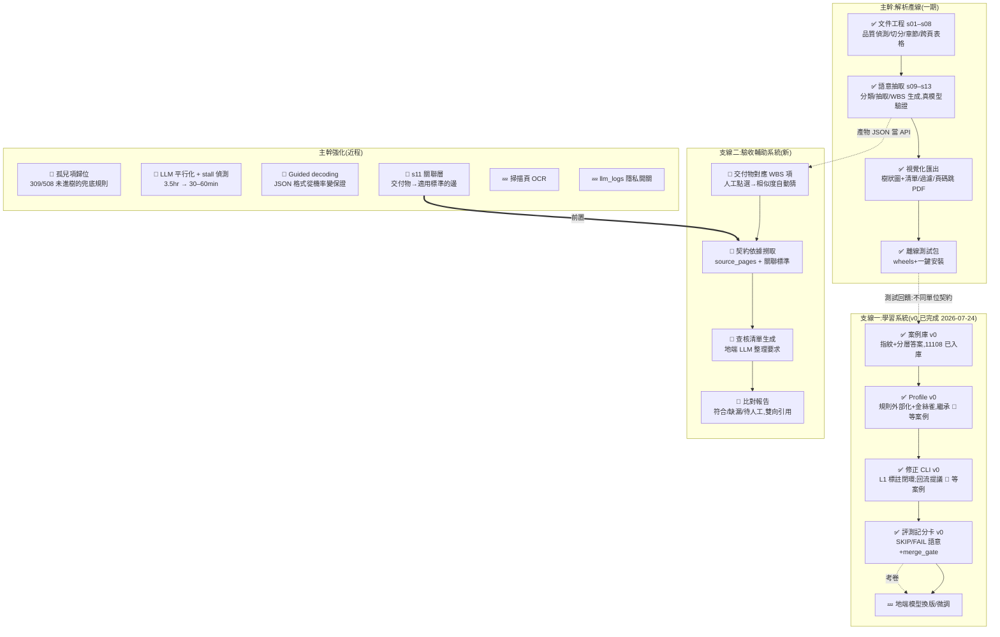

# ROADMAP — WBS 系統技能樹

> 主幹是「契約 → WBS」產線;支線是吃產線輸出長出來的新能力。
> 標記:✅ 已點亮 · 🔨 進行中/近程 · 🌱 已設計待動工 · 💤 遠期

## 主幹:解析產線(一期)✅

契約 PDF → 品質偵測(亂碼/掃描頁隔離)→ 子文件切分 → 章節/表格 →
分類過濾(EXCLUDED 不進 WBS)→ 地端 LLM 語意抽取 → 三層 WBS →
互動視覺化 + xlsx/csv/json。

已驗證:contract_11108(309 頁)真模型跑出 508 工作項、45 節點、
100% 繁中、12 類別、PAYMENT/ACCEPTANCE 可回溯至附件2/附件9 頁碼。
離線測試包已發同仁。

## 主幹強化(近程,依優先序)

| 項目 | 內容 | 為什麼 |
|---|---|---|
| 孤兒項歸位 | LLM 分群沒引用的工作項,依 section 兜底掛樹,標記規則式來源 | 完整性:508 項只有 199 進樹 |
| 平行化+stall 偵測 | vLLM 併發 4–8、連線無資料即斷線重試 | 尖峰 3.5 小時不可用;曾單次卡 84 分鐘 |
| Guided decoding | vLLM schema 強制生成 | 147 次呼叫 0 壞 JSON 是運氣,要變保證 |
| s11 關聯層 | 「依附件N」「悉依…規範」句型規則 + LLM 補隱性關聯 | 支線二的前置;驗收依據查詢 |
| 視覺化小修 | 展開項目文字直排(窄欄換行) | 顯示品質 |
| llm_logs 開關 | log 可選只存 hash 不存原文 | 契約內容散落各機器 |
| 掃描頁 OCR | p154–163 類文件 | 低優先,等有需求 |

## 支線一:學習系統(v0 已完成,2026-07-24,commit f9be078–234e314)

讓解析「越用越聰明」:格式知識外部化成 profile、失敗落地成 NEEDS_REVIEW、
人工修正回流成 profile 規則+回歸案例、全案例評測當剎車。
聰明積累在地端資產(案例庫/profile/評測),模型只是可換引擎。
設計定案紀錄見 grok.md(三輪外部評審);任務書見 LEARNING_V0.md。

**v0 已交付**(55 測試綠):
- Profile v0:s04/s06/s09 規則全數搬入 profiles/default.toml,
  程式零業務字面量(靜態檢查擋)+ 金絲雀/反金絲雀常駐測試
- 案例庫 v0:cases/case-11108.json(指紋無原文、無執行期 id、
  source×status 正交)
- 評測 v0:wbs eval run 四層記分卡(11108 全 1.000)、
  缺 PDF=SKIP、sha 不符=FAIL、merge_gate 剎車
- 修正 CLI v0:wbs review list/annotate/accept——xlsx 預填標註
  (L1 切分,doc_type 下拉)→ 案例入庫為 draft

**尚未做(等 5–10 份不同單位真實失敗案例)**:三層繼承分類法、
回流提議器(L4)、L2–L4 標註 CLI、promote 指令。

## 支線二:驗收輔助系統(構想 2026-07-23)

場景:廠商交付「每月定期工作報告」→ 系統對應到 WBS 交付項 →
依 source_pages 撈契約依據(如表5 p79–85)+ 關聯標準(附件3 編製規範)→
地端 LLM 整理成查核清單 → 逐條比對廠商文件 →
產出「符合/缺漏/待人工」報告,每條帶雙向引用(契約頁 + 交付文件頁)。

- 不重新解析契約:直接吃一期產物 JSON(這就是頁碼追溯的設計目的)
- 廠商文件用同一套 parse/quality 引擎讀
- 人做最終判定,系統只做對照工
- 輸入小(一份報告+幾頁契約),尖峰時段也跑得快
- **前置:s11 關聯層**(否則查核清單撈不全依據)

## 依賴關係總覽

- 測試回饋(不同單位契約)→ 支線一開工
- s11 關聯層 → 支線二的依據撈取
- 案例庫評測 → 遠期模型換版/微調的驗收考卷
- 一期產物 JSON = 所有支線的 API,格式變更需考慮下游
